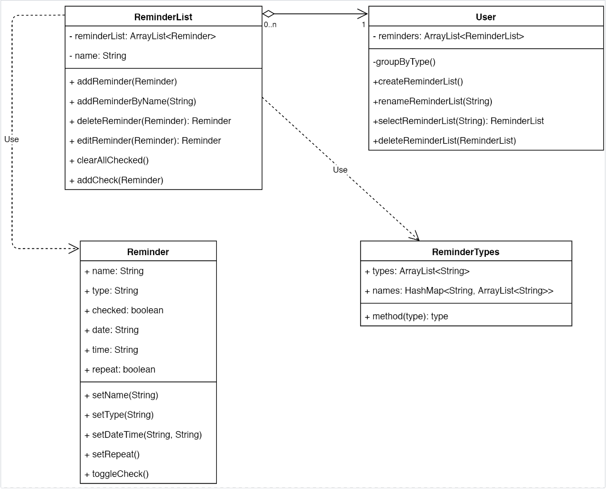
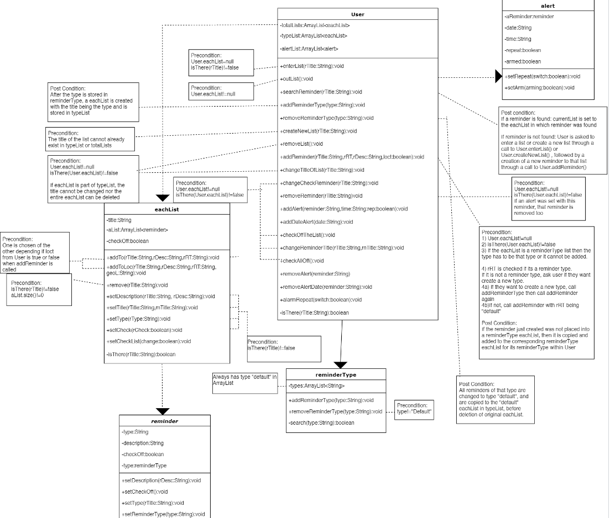
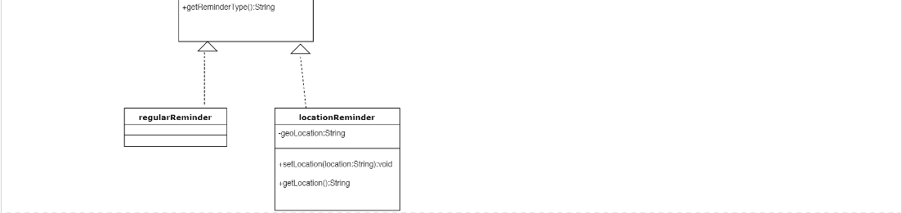
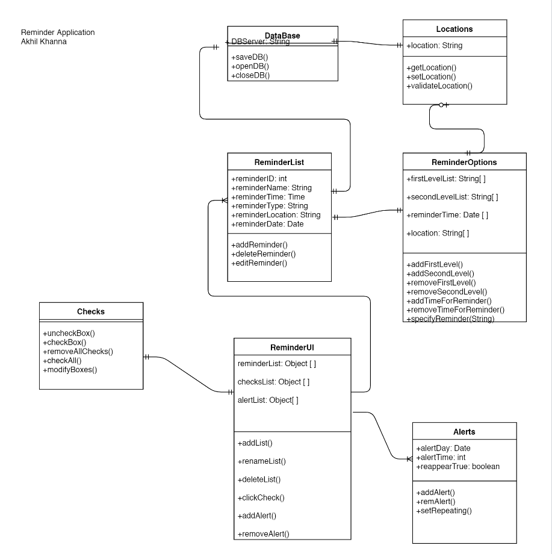
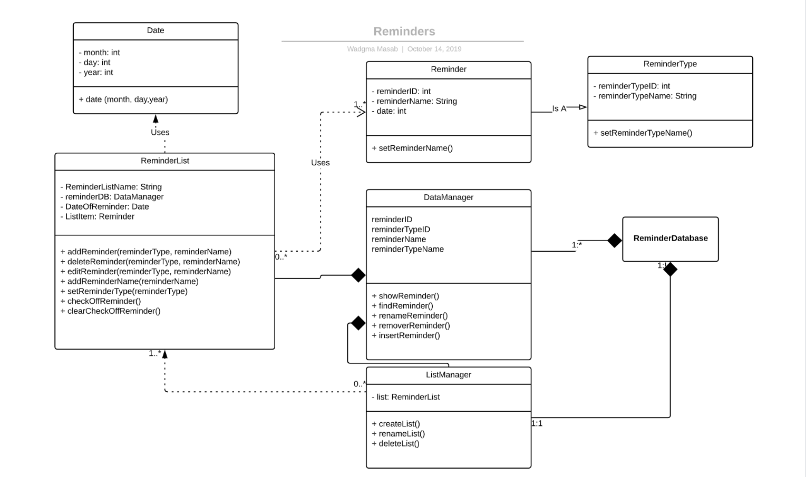
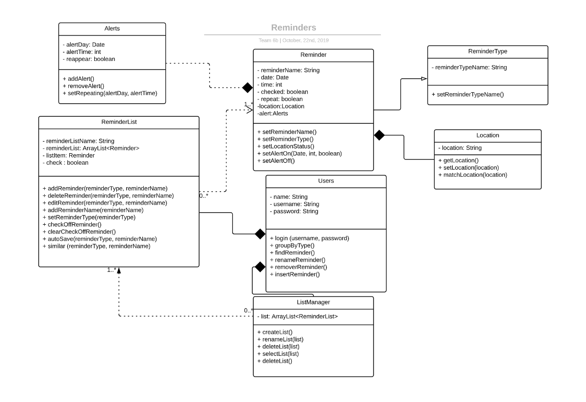

# Design 1 - Joesph's Design

## Pros:
1) The diagram is simple and concise to read and follow what is going on.  
2) His design is easy to implement to get up and running fast.  
3) A possible good foundation to build off of.  
## Cons:
1) The reminder classes are not fully implemented with certain details left out.  
2) Doesn't take into account locations for the reminders which is a feature we want to have.  
3) Alerts are built inside the reminder class, we most likely would want Alerts to be a separate class.  

# Design 2 - Jeffrey's Design

## Pros:
1) Diagram is very detailed with his pre and post conditions to show functionality.  
2) Implements features we want to have such as alerts, location reminders, etc.  
3) Has extra features such as having an automatic list of reminderTypes and custom lists.  
## Cons:
1) Diagram is hard to follow and understand as his details make it complicated.  
2) Has features which we don't want in our final diagram.  
3) reminderType class is not placed in ideal position in diagram.  

# Design 3 - Akhil's Design

## Pros:
1) Has a good flow to diagram with every class connected and working well with each other.  
2) Has location and alert classes which we want in our final design.  
3) Implements storage of reminders and reminderLists through array like data structure.  
## Cons:
1) Reminder Options entity is unnecessary, this can be reduced to parameters in the methods in Reminders. 
2) Diagram is missing parameters in the methods along with the return types.  
3) Has a database class we don't want and a separate check class instead of having checks built inside reminder.  

# Design 4 - Wadgma's Design

## Pros:
1) Easy to merge all our ideas to with this design.  
2) Design is a good base skeleton to build off of to add any features we want.  
3) It is organized in regards on how reminders, reminderType, reminderList and database work together. 
## Cons:
1) Attribute types are not represented efficiently, for example we would want an ArrayList etc.  
2) Doesn't have any specific User class in it, making it hard to see what the User can fully do.   
3) Is missing certain features such as alerts and locations in it.  

# Team Design

## Our Design Decisions
For our design we will be building it off of Wadgma's Design, as we feel hers is a perfect middle ground for all our ideas. Akhil's and Joesph's designs were both simple and easy to implement, however lacked certain features we wanted in our final design. Jeffrey's design, even though very detailed, was very complicated and had features which we didn't want. In addition, implementation would be difficult because of complexity. This is why we ended up choosing Wadgma's design. Her design is not perfect though and modifications must be made to fit our ideal final design. We first had to remove her database classes, as we didn't want those in our UML diagram. Next thing we had to do was implement a some form of a User class. This was very straight forward as Akihil's, Joesph's and Jeffrey's designs had a User class in them. In addition, Wadgma's design had somewhat of a User class in it already as her Database class acted like it. The next thing we had to do was implement the option for the user to have a location based reminder, and also add in alerts. The location was added by creating a class to it and connecting it to the reminder class, and adding an option to have it in there. For alerts, we created a separate Alert class which works with the reminder and User classes. New setters were created in the reminder class to allow changes to be made to the alert and location of a reminder. The last thing we had to do was implement some form of data structure to group up reminders and reminderLists together. For this we chose to implement ArrayLists to hold all them and categorize them. ArrayLists were the perfect data structure as you can easily add and remove from them. Each reminderList has an ArrayList of reminders in it, and their is a central ArrayList in the User class which holds all the reminderLists. This is how we ended up creating our final design.   

# Summary
We learned a lot throughout the process of reviewing each others UML diagrams. For us it was very interesting to see how each member tackled the design and how they implemented their features. All of us took different approaches towards the implementation of a feature but all ended up with the same feature. Throughout the process we saw that some members took more simplistic approaches meanwhile others went for more complex builds. Each one of these approaches had their own strengths and weaknesses to it. One of the most glaring ones is how easy or hard it will be to actually build the design. The simplistic designs would be easy to build and run, but would end up lacking certain features which would have given the app more depth. Meanwhile a more complex approach, would give this depth to the app with many more features, however the complexity would make it hard to code up. In addition, make it hard for the actual User to understand how to use the app. We ended up having to come to middle ground where simplicity meets with complexity. To achieve this, compromises had to be made between all designs, and feedback from each member was mandatory. We learned that in a team setting that feedback was the most important aspect to create something, no one person could create the perfect design on their own. In the end, we all understood that everybody shared the same weight on their back.
