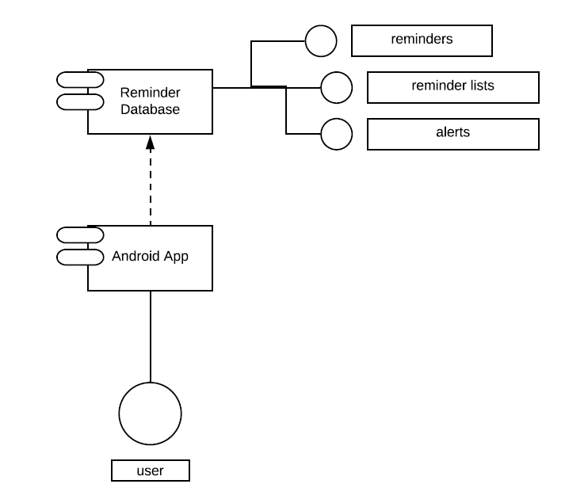
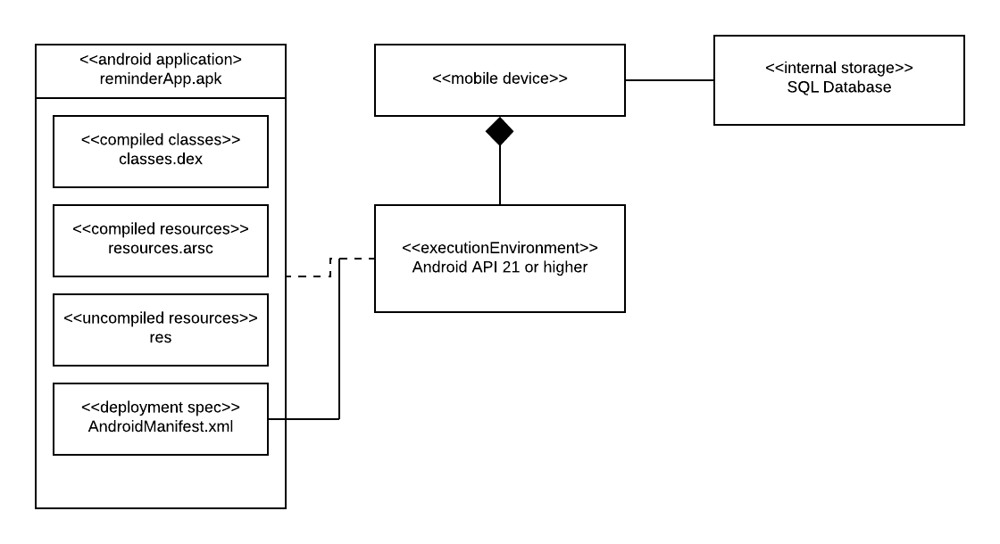
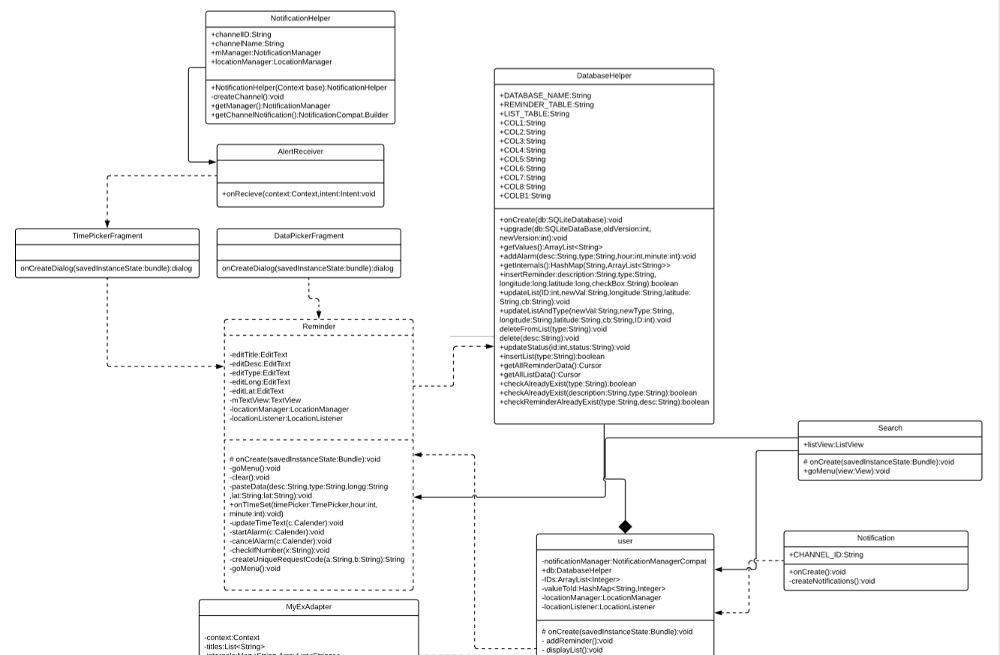
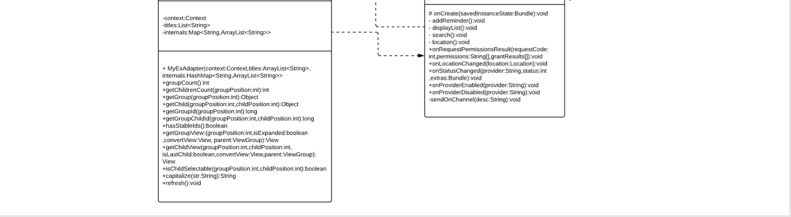
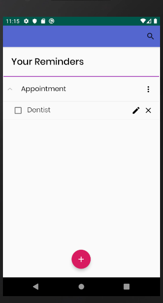
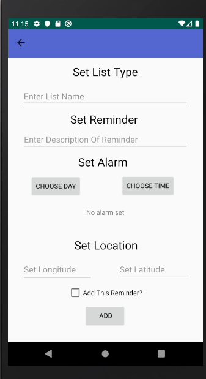

# Design Document

**Author**: Team 6B

## 1 Design Considerations

### 1.1 Assumptions

The app our team is building is a reminder app which will allow users to create reminders to help around with their daily lives. The users would be able to create reminders, edit those reminders and delete those reminders. In addition, every reminder will be grouped by type into objects called lists of reminders. Every reminder has an option to be checked off. Alerts can be added to each reminder which will send an alarm to the user when time and date comes. Every reminder also has an option to have a location tagged on to it. We assume that the user who will be using our reminder app will be running it on a android device with at least API level 21. The overall app is dependent on the connection to a internal database which holds all data from the app.

### 1.2 Constraints

The only constraints we can think about is possibly the amount of free memory in the android device. If the android device cannot store the app's database in the storage than the app would not function properly. The app should be able to add as many reminders as it can up until the limits of the device's memory.

### 1.3 System Environment

The hardware in which our app will have to run in would be some sort of android device. This device will have to have an appropriate amount of memory to store all of the app's data. In addition, if the user wants to use the location feature of the app. They must have an device which allows for the current location of the device holder to be obtained.

## 2 Architectural Design

### 2.1 Component Diagram

  
The component diagram is very basic and simple, as it only contains the application and database. It was made this simple as these are the only components needed for the application to work properly. There is only one way to access and change data, and only one way to use the functionality of the application. This is through the user using the android app. This android app is then connected to a database which stores all data contained from the app. It is because of this that the android app is dependent on the database. The data that the database holds are all the reminder lists, reminders and alerts, as these are the objects the android app stores in the database.

### 2.2 Deployment Diagram
  
The deployment diagram is very basic and simple like the component diagram. The main parts of the deployment diagram revolves around the android application, android device, and the database. The android application box contains all files that will be used to run the reminder app. Next box, the execution environment, contains what OS the app can run which is Android. Lastly, the last two boxes helps show the connection between a mobile device that runs android to the internal SQL database. This connection needs to be shown as the app stores all data into this database.

## 3 Low-Level Design

### 3.1 Class Diagram
  
  
UML Diagram of Classes

### 3.2 Other Diagrams

## 4 User Interface Design
  
  
  
UI Mock Up
