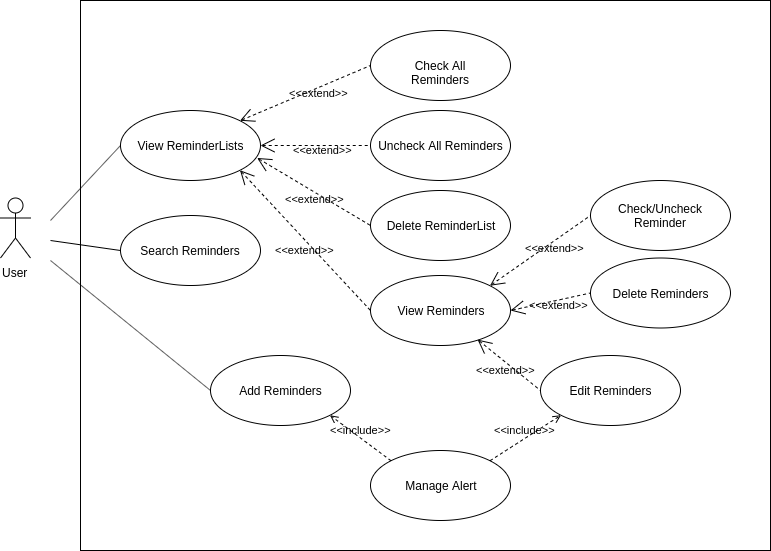

# Use Case Model

**Author**: Team 6B

## 1 Use Case Diagram

 

## 2 Use Case Descriptions

### View ReminderLists
- *Requirements: Allows the user to view lists of reminders they have created.*
- *Pre-conditions: None*
- *Post-conditions: None*
- *Scenario: The only possible scenario is that the user opens the app and sees a list of expandable reminders they created.*

### Edit Reminders
- *Requirements: Allows the user to create a reminder, edit an existing reminder, or delete an existing reminder.*
- *Pre-conditions: None*
- *Post-conditions: System enables user to create, edit, or remove reminders.*
- *Scenario: The user has clicked on a reminder list and reminders inside that list are displayed to the user as a dropdown 
If the user wants to create a new reminder, the system will take the user to the create reminder screen. Likewise, for editing existing reminders and deleting reminders, the system will show the user the appropriate screen.*

### Delete ReminderList
- *Requirements: Allows user to delete reminder lists.*
- *Pre-conditions: At least one ReminderList is available.*
- *Post-conditions: The reminder list is deleted, no longer viewable on the app and is deleted from the DB.*
- *Scenario: User opens the app and sees a reminder list they want to delete. User then taps the options menu next to the reminder list. They then click on the Delete List button on the popup. Then, the system deletes the reminder list by deleting all reminders in that list from the database and updates the changes on the view.*

### Check All Reminders
- *Requirements: Allows the user to check of all reminders in the corresponding reminder list.*
- *Pre-conditions: The reminder list to be checked off is left unchecked. *
- *Post-conditions: Reminder list is checked off and saved in the database. However, it is not deleted.*
- *Scenario: The user wants to check off a reminder list, meaning all reminders that belong in that list.  The user clicks the options menu next to the reminder list, then clicks on the check all button. The system then checks off all reminders inside that reminder list.*

### Uncheck All Reminders
- *Requirements: Allows the user to uncheck of the corresponding reminder list.*
- *Pre-conditions: The reminder list to be checked off is checked off.*
- *Post-conditions: All reminders in the Reminder list are not checked off and the check off flags of each reminder are updated in the database.*
- *Scenario: The user wants to un-check a checked off reminder list. The user clicks the options menu next to the reminder list, then clicks uncheck all.  The system then goes through all reminders in the list and uncheck them, as well as updating the values in the database. The checkbox button is then cleared for all reminders in the reminder list.*

### Add Reminders
- *Requirements: Allows user to create a reminder.*
- *Pre-conditions: None*
- *Post-conditions: Reminder is created and saved.*
- Scenarios: 
1. User clicks the add button (+ icon) located at the bottom of the reminder list view.
2. Add reminder view appears the user chooses the name of the reminder.
3. The user then chooses the list name and a description of the reminder if the user wants a reminder to be in the list immediately.
4. If the user cannot find the reminder, they add the reminder by typing in the name.
5. The system saves the new reminder name in the database if it didn't exist. 
6. The user then clicks add and the system saves the values.
7. Finally there is a segue back to the new Reminder List view with the added reminder.

### Edit Reminder
- *Requirements: Allows the user to edit a reminder.*
- *Pre-conditions: The reminder to be edited must exist on the database.*
- *Post-conditions: Reminder is updated with new values.*
- Scenarios: 
1. User chooses to update a reminder.*
2. If the user wants to change the name or type of the reminder, the user types a reminder name in the search box.
3. The system goes through the scenario for "Search for Reminder" use case.
4. If the user wants to change other attributes, they input the new values manually.
5. User submits the changes.
6. The system saves the updated values to the database.

### Delete Reminder
- *Requirements: Allows the user to delete a reminder.*
- *Pre-conditions: User wants reminder to be deleted. The reminder exists in the database.*
- *Post-conditions: The reminder is deleted from the database.*
- *Scenarios: 
1. User selects the Reminder List name where the wanted deleted reminder is inside of
2. The user scrolls through the reminder list and clicks x on the reminder that the user wants to delete.

### Check Reminder
- *Requirements: Allows user to check off a reminder on their list.*
- *Pre-conditions: User wants to check off a reminder. The reminder exists on the reminder list and is unchecked.*
- *Post-conditions: Desired reminder is checked off, however still exists in the DB, in case the user wants to uncheck it.*
- *Scenarios: User opts to check off a reminder by clicking on checkbox next to the reminder. Then, the applicaton checks off the reminder, meaning the checkbox is checked in the view and the values is updated as checked in the DB.*

### Uncheck Reminder
- *Requirements: Allows user to uncheck a checked reminder on their list.*
- *Pre-conditions: User wants to uncheck a reminder. The reminder is marked as checked on the database.*
- *Post-conditions: Desired reminder is marked unchecked.*
- *Scenarios: User opts to uncheck a reminder by clicking on checkbox next to the reminder. Then, the application unchecks the reminder, meaning the checkbox is unchecked in the view and the reminder's checkoff value is updated as unchecked in the DB.*

### Search Reminders
- *Requirements: Allows the user to search for a reminder*
- *Pre-conditions: The user is on the main activity page.*
- *Post-conditions: The system will show user a page with the search results*
- Scenario:
1. User wants to search for a reminder by it's description.
2. User clicks on search icon located top-right of the screen
3. User specifies a reminder by typing its name. 
4. The application look in its DB for reminders. 
4. If a match (or nearby match) cannot be found, the application will show a toast notifying the user that a match could not be found.
5. If a match/matches are found, the application will show user a page with the results.
6. User can click on a reminder on the page to view it's details.

### Manage Alert
- *Requirements: Allows user to set a new alarm or to edit an existing alarm.*
- *Pre-conditions: User wants to set an alarm or make changes to an alarm.*
- *Post-conditions: User successfully added/changed alarm.*
- Scenarios: 
- Scenario One: User is creating a new reminder and also wants to be alerted.
1. User is creating a reminder and clicks on the create alarm button.
2. System prompts user to add a date and a time as well as if the user wants the alarm to be repeated.
3. User enters necessary inputs.
4. The system updates the database. 
- Scenario Two: User wants to add an alert on an existing reminder.
1. If user wants to add an alert time, the system will prompt the user after user clicks button.
2. The rest of the steps will be the same as scenario one.
3. If user wants to edit an existing alarm.
- Scenario Three: User wants to edit an alert on an existing reminder.
1. User is viewing a reminder and clicks on the edit alert button.
2. User enters a new date and time for the alert. 
3. User selects whether they would like the alarm to be repeated.
4. After user submits the changes, the system updates the database with appropriate values.
- Scenario Four: User wants to delete an alert on an existing reminder.
1. The user opts to delete the alert.
2. The values are deleted by the system.

